# 🌍 Humanity — Donation & Volunteer Platform

<p align="center">
  <strong>An Android app connecting communities through donations, jobs, and volunteering.</strong><br>
  Built with Kotlin · Jetpack Compose · Material 3
</p>

---

## 📖 About This Project

**Humanity** is a modern Android application that empowers users to make a difference through:

- 💰 **Donating** to campaigns that fight poverty
- 💼 **Finding jobs** suited for those in need
- 🤝 **Volunteering** in local community events
- 👤 **Managing profiles** with personalized experiences

The app uses **Jetpack Compose** for a fully declarative UI — no XML layouts needed. Navigation between screens is handled by **Jetpack Navigation Compose**.

---

## ✅ Requirements

| Tool | Version |
|------|---------|
| [Android Studio](https://developer.android.com/studio) | Ladybug 2024.2.1 or newer |
| Kotlin | 1.9+ (bundled with Android Studio) |
| JDK | 11+ (bundled with Android Studio) |
| Android SDK | API 24 minimum · API 36 target |
| Git | Any recent version |

> 💡 **Note:** Android Studio includes the JDK and Kotlin compiler — no separate installation required.

---

## 🚀 Installation & Setup

### Step 1 — Clone or Download the Project

```bash
git clone https://github.com/your-username/Project1_Humanity.git
```

Or click **Code → Download ZIP** on GitHub, then extract the folder.

---

### Step 2 — Open in Android Studio

1. Launch **Android Studio**.
2. Click **File → Open** (or **"Open"** on the Welcome screen).
3. Navigate to the extracted/cloned folder and select the **root folder** named `Project1_Humanity`.
4. Click **OK**.

> ⚠️ **Important:** Always open the **root project folder** (the one containing `settings.gradle.kts`), NOT the `app` subfolder.

---

### Step 3 — Sync Gradle

When the project opens, Android Studio will begin a **Gradle Sync** automatically.

- Watch the **progress bar** at the bottom of the screen.
- If prompted to download missing SDK components, click **Install**.
- If sync doesn't start, manually trigger it: **File → Sync Project with Gradle Files**.

> 💡 **Tip:** First sync requires an internet connection and may take a few minutes.

---

### Step 4 — Run the App

#### Option A: Android Emulator

1. Go to **Tools → Device Manager**.
2. Click **Create Virtual Device**.
3. Pick a phone model (e.g., **Pixel 7**) → **Next**.
4. Select a system image with **API 30+** → **Next → Finish**.
5. Click the ▶️ button next to the emulator to start it.

#### Option B: Physical Device

1. On your phone: **Settings → About Phone → tap "Build Number" 7 times** to enable Developer Options.
2. Go to **Settings → Developer Options → enable USB Debugging**.
3. Connect via USB and accept the debugging prompt on your phone.

#### Run

1. Select your device from the **toolbar dropdown**.
2. Click the green **▶️ Run** button (or press `Shift + F10`).
3. The app will build and launch automatically.

---

## 🖥️ Recommended: Switch to "Android" View

This is the **most important step** for navigating the project easily.

### What is the Project Tool Window View Selector?

When you open a project, the left panel shows your files. At the **very top of that panel**, there's a small **dropdown menu** — this is the **view selector**.

### How to Switch

1. Look at the **top-left corner** of the Project Tool Window (the file tree panel).
2. Find the dropdown that says **"Project"** (this is the default).
3. **Click it** and select **"Android"** from the list.

### Why Use "Android" View?

| Feature | Project View | Android View ✅ |
|---------|-------------|----------------|
| Folder depth | Deep nested paths | Flat, logical groups |
| File organization | Raw filesystem | Grouped by purpose |
| Beginner-friendly | ❌ Confusing | ✅ Clear & simple |
| Shows Gradle Scripts | Hidden in tree | Dedicated section |
| Resource navigation | Buried in `res/` subfolders | Clean categories |

> 📌 **The "Android" view doesn't move or change your files.** It simply presents them in a way that makes Android development easier.

---

## 📂 Project Structure (Android View)

Once you switch to **Android** view, you'll see this organized layout:

```
📦 app
│
├── 📁 manifests
│    └── AndroidManifest.xml
│
├── 📁 java
│    └── com.example.a210615_aniq_drnelson_project1
│         │
│         ├── MainActivity.kt                ← App entry point
│         │
│         ├── 📁 components/                 ← Reusable UI pieces
│         │    ├── BottomNavigationBar.kt
│         │    └── UsernameHeader.kt
│         │
│         ├── 📁 data/                       ← Data models
│         │    └── UserData.kt
│         │
│         ├── 📁 navigation/                 ← Screen routing
│         │    ├── AppScreen.kt              (screen name definitions)
│         │    └── NavGraph.kt               (navigation logic)
│         │
│         ├── 📁 screens/                    ← All app screens
│         │    ├── 📁 auth/
│         │    │    ├── LoginScreen.kt
│         │    │    ├── SignUpScreen.kt
│         │    │    └── CustomTextField.kt
│         │    │
│         │    ├── 📁 main/
│         │    │    ├── MainScreen.kt
│         │    │    ├── HumanityHomeUI.kt
│         │    │    ├── DonateScreen.kt
│         │    │    ├── JobsScreen.kt
│         │    │    ├── VolunteerScreen.kt
│         │    │    ├── ProfileScreen.kt
│         │    │    └── WelcomeScreen.kt
│         │    │
│         │    ├── 📁 donation/
│         │    │    ├── DonationFormScreen.kt
│         │    │    ├── SummaryScreen.kt
│         │    │    ├── BankLoginScreen.kt
│         │    │    ├── ApprovalScreen.kt
│         │    │    ├── CompleteScreen.kt
│         │    │    └── ThankYouScreen.kt
│         │    │
│         │    └── 📁 editprofile/
│         │         └── EditProfileScreen.kt
│         │
│         ├── 📁 ui/theme/                   ← Colors, typography, theme
│         └── 📁 viewmodel/                  ← App state management
│              └── AppViewModel.kt
│
├── 📁 res
│    ├── 📁 drawable/                        ← Icons & images
│    ├── 📁 drawable-nodpi/                  ← Full-size images
│    ├── 📁 mipmap/                          ← App launcher icons
│    ├── 📁 values/                          ← Colors, strings, themes
│    └── 📁 xml/                             ← Backup rules
│
📦 Gradle Scripts
├── build.gradle.kts (Project)
├── build.gradle.kts (Module: app)
├── settings.gradle.kts
└── libs.versions.toml                       ← Dependency version catalog
```

---

## 🎯 Where Development Happens

Almost all your coding takes place inside this path:

```
Project1_Humanity/app/src/main/java/com/example/a210615_aniq_drnelson_project1/
```

In the **Android view**, this appears simply as:

```
app → java → com.example.a210615_aniq_drnelson_project1
```

This is where you'll find and create all Kotlin files — screens, components, navigation, data models, and view models.

### Why This Folder?

| Reason | Explanation |
|--------|-------------|
| Package root | All Kotlin classes belong to this package namespace |
| Organized subfolders | Screens, components, data, navigation are logically separated |
| Single source of truth | Every screen, model, and function lives here |
| Android convention | Standard Android project structure for source code |
| Easy imports | All files share the same base package, making imports simple |

---

## 🏗️ Software Architecture & Design

### Architecture Pattern: MVVM (Model-View-ViewModel)

This project follows the **MVVM** architecture pattern, which separates concerns into three layers:

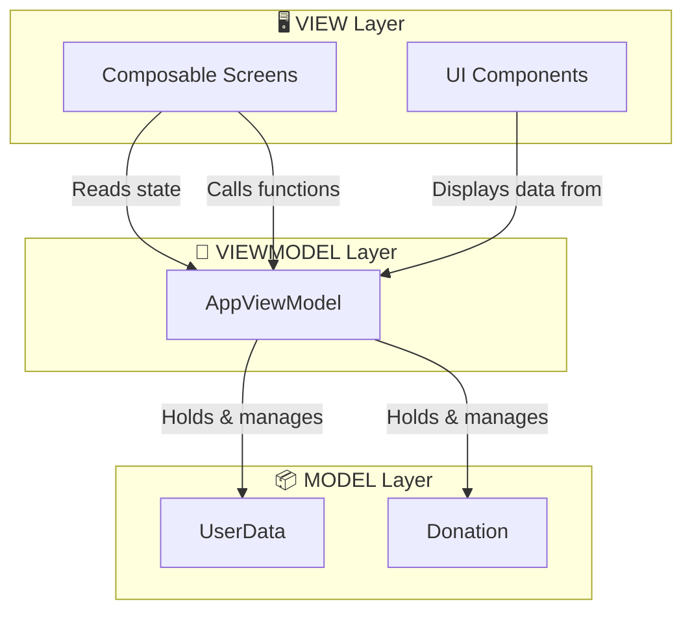

| Layer | Role | Files in This Project |
|-------|------|----------------------|
| **View** | Displays UI, handles user interaction | All files in `screens/` and `components/` |
| **ViewModel** | Holds app state, business logic | `viewmodel/AppViewModel.kt` |
| **Model** | Data structures | `data/UserData.kt`, `data/Donation` |

### Why MVVM?

- **Separation of concerns** — UI code doesn't mix with logic
- **Survivable** — ViewModel survives screen rotations
- **Testable** — Logic can be tested without UI
- **Reactive** — UI automatically updates when data changes

---

## 🔗 How Everything Connects Together

### App Architecture Diagram

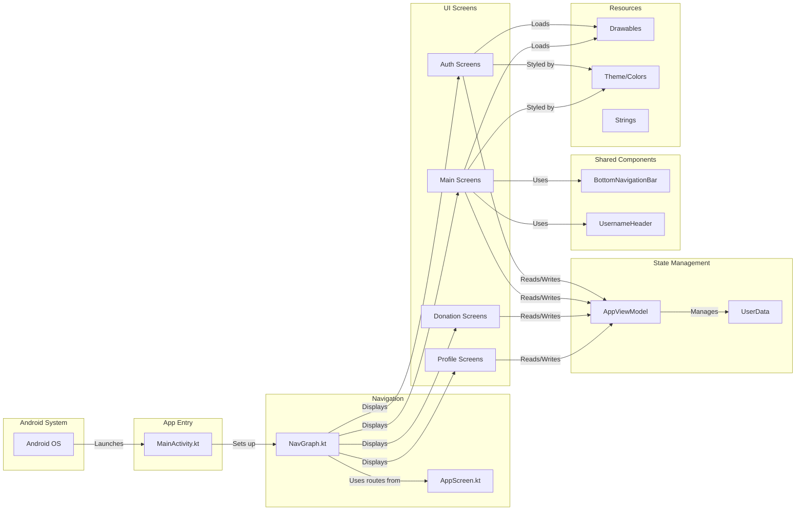

### File Relationship Summary

| File | Depends On | Used By |
|------|-----------|---------|
| `MainActivity.kt` | NavGraph, AppTheme | Android System (entry point) |
| `NavGraph.kt` | AppScreen, All Screens, AppViewModel | MainActivity |
| `AppScreen.kt` | Nothing (enum definitions) | NavGraph, BottomNavigationBar |
| `AppViewModel.kt` | UserData, Donation | All Screens |
| `UserData.kt` | Nothing (data class) | AppViewModel |
| `BottomNavigationBar.kt` | AppScreen, NavController | MainScreen, DonateScreen, etc. |
| `LoginScreen.kt` | NavController, AppViewModel, CustomTextField | NavGraph |
| `DonationFormScreen.kt` | NavController, AppViewModel | NavGraph |

---

## 🔄 Understanding the Project Flow

### How the App Starts

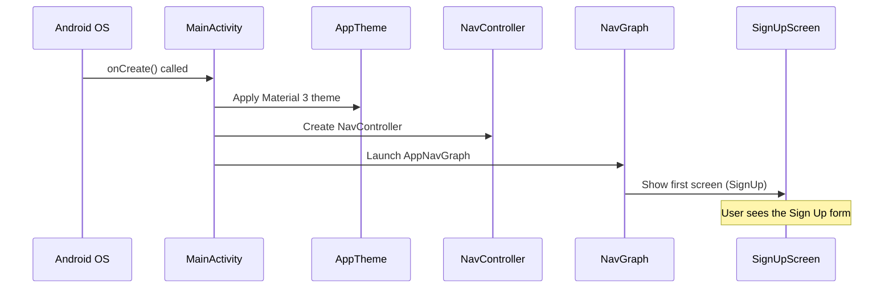

### How a User Action Flows Through the App

When a user taps a button (e.g., "Donate Now"):

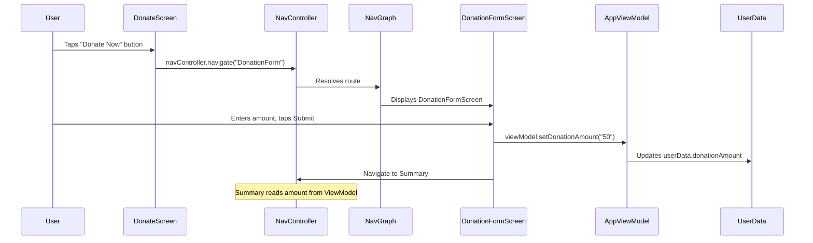

---

## 🧭 Screen Navigation Flow

### Complete Navigation Map

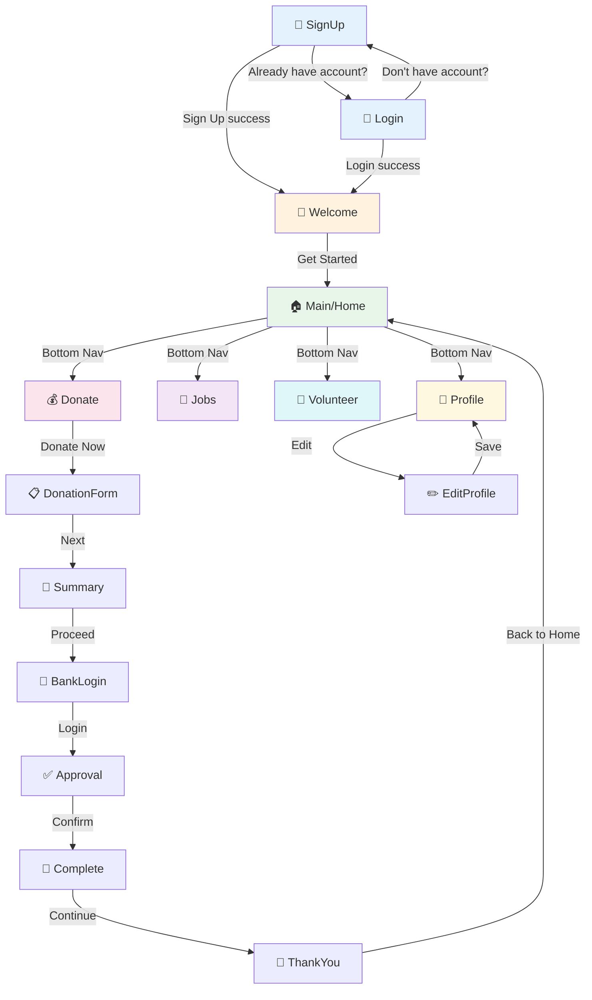

### Bottom Navigation Structure

The app uses a **persistent bottom navigation bar** on main screens:

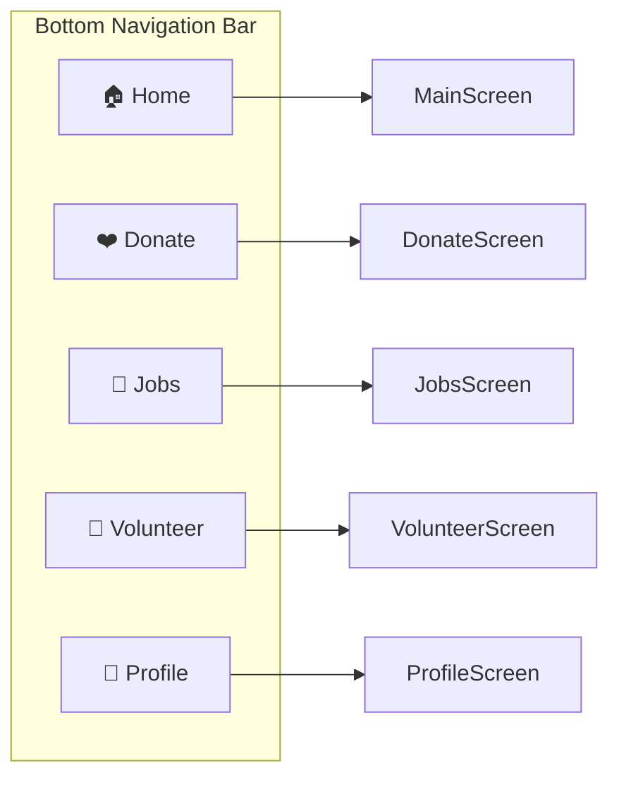

---

## 🔌 UI-to-Code Connection

### How UI Elements Map to Code

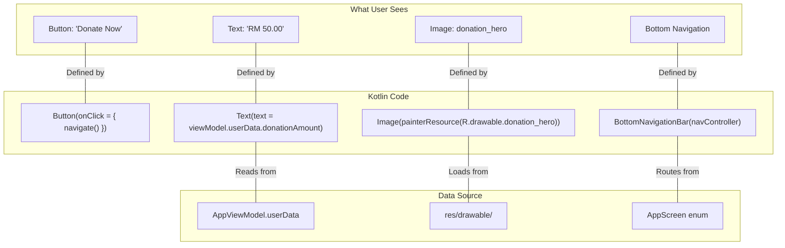

### Button Click → Action → Screen Change

Here's exactly what happens when a user taps a button:

```kotlin
// 1. User taps this button in DonateScreen.kt
Button(onClick = {
    navController.navigate(AppScreen.DonationForm.name)  // 2. Triggers navigation
}) {
    Text("Donate Now")  // 3. What the user sees
}

// 4. NavGraph.kt catches the route and shows DonationFormScreen
composable(AppScreen.DonationForm.name) {
    DonationFormScreen(navController, viewModel)  // 5. New screen appears
}
```

### How Data Flows from Input to Display

```kotlin
// Step 1: User types in DonationFormScreen.kt
TextField(value = amount, onValueChange = { amount = it })

// Step 2: User submits → ViewModel stores it
viewModel.setDonationAmount(amount)

// Step 3: SummaryScreen.kt reads it
Text("Amount: RM ${viewModel.userData.donationAmount}")
```

---

## 📊 Data & Function Connection Diagram

### ViewModel as Central Hub

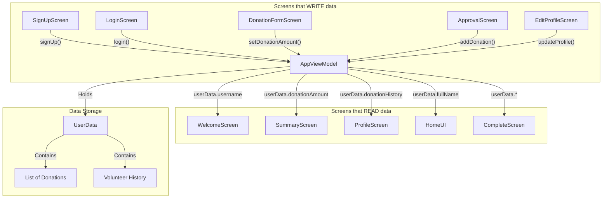

### Key ViewModel Functions

| Function | What It Does | Called By |
|----------|-------------|-----------|
| `signUp()` | Stores new user registration data | SignUpScreen |
| `login()` | Validates username & password | LoginScreen |
| `setDonationAmount()` | Saves donation amount for flow | DonationFormScreen |
| `addDonation()` | Records completed donation with timestamp | ApprovalScreen |
| `updateProfile()` | Updates user profile fields | EditProfileScreen |
| `logout()` | Resets all user data | ProfileScreen |
| `clearDonationAmount()` | Clears temporary donation data | ThankYouScreen |

---

## 🔄 Android Lifecycle Basics

### What is the Android Lifecycle?

Every Android app goes through **lifecycle states**. Understanding this helps you know when your code runs.

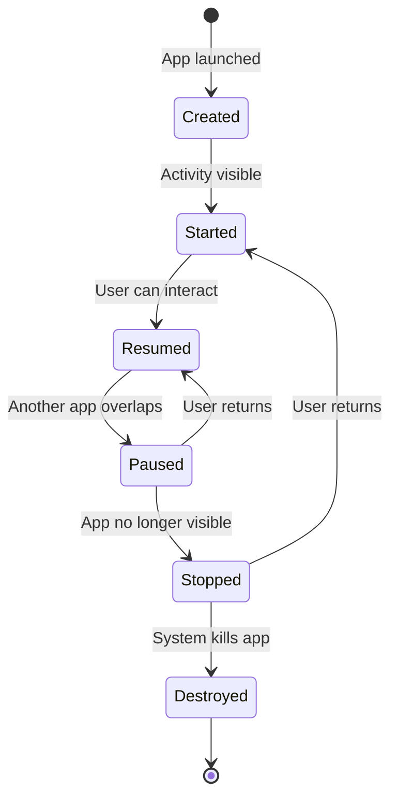

### How This Project Handles Lifecycle

| Concern | How It's Handled |
|---------|-----------------|
| App start | `MainActivity.onCreate()` sets up Compose UI |
| Screen rotation | **ViewModel** survives rotation — data is preserved |
| User leaves app | Compose state is saved automatically |
| App killed by system | Data is lost (no persistent storage in this project) |

> 💡 **Key Insight:** The `AppViewModel` survives configuration changes (like rotation). That's why all screens read data from the ViewModel instead of storing it locally.

### Compose Lifecycle vs Activity Lifecycle

In Jetpack Compose, you don't manage lifecycle directly. Instead:

```kotlin
// Compose handles recomposition automatically
@Composable
fun ProfileScreen(viewModel: AppViewModel) {
    // This re-runs whenever viewModel.userData changes
    Text(text = viewModel.userData.username)
}
```

When `viewModel.userData` changes, Compose **automatically redraws** the affected UI. No manual `findViewById()` or `setText()` needed.

---

## 🗂️ How Android View Helps Development

### Android View vs Project View — Side by Side

#### ❌ Project View (Confusing for Beginners)

```
Project1_Humanity/
├── .gradle/
├── .idea/
├── app/
│   ├── build/
│   ├── src/
│   │   ├── androidTest/
│   │   │   └── java/
│   │   │       └── com/
│   │   │           └── example/
│   │   │               └── a210615_aniq_drnelson_project1/
│   │   │                   └── ExampleInstrumentedTest.kt
│   │   ├── main/
│   │   │   ├── java/
│   │   │   │   └── com/
│   │   │   │       └── example/
│   │   │   │           └── a210615_aniq_drnelson_project1/
│   │   │   │               ├── MainActivity.kt    ← 6 levels deep!
│   │   │   │               └── ...
│   │   │   └── res/
│   │   └── test/
│   └── build.gradle.kts
├── gradle/
└── settings.gradle.kts
```

#### ✅ Android View (Clean & Logical)

```
app/
├── manifests/          ← 1 click away
├── java/              ← 1 click to your code
│   └── (your package) ← All your Kotlin files
├── res/               ← 1 click to resources
Gradle Scripts/        ← Always visible
```

### What Each Top-Level Folder Contains

| Folder | Purpose | What You'll Do Here |
|--------|---------|-------------------|
| **manifests** | App configuration, permissions, activity declarations | Rarely edit (only for permissions or new activities) |
| **java** | All Kotlin/Java source code | 🔥 **90% of your work happens here** |
| **res** | Images, icons, colors, strings, themes | Add images, change colors/strings |
| **Gradle Scripts** | Build configuration, dependencies | Add libraries, change SDK versions |

---

## 🔧 Development Workflow in Android Studio

### Daily Development Cycle

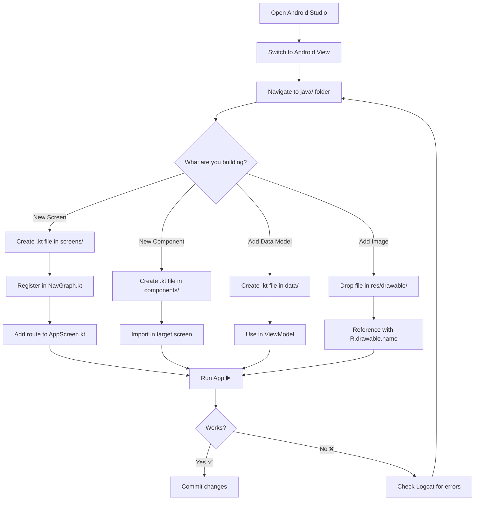

### Step-by-Step: Adding a New Screen

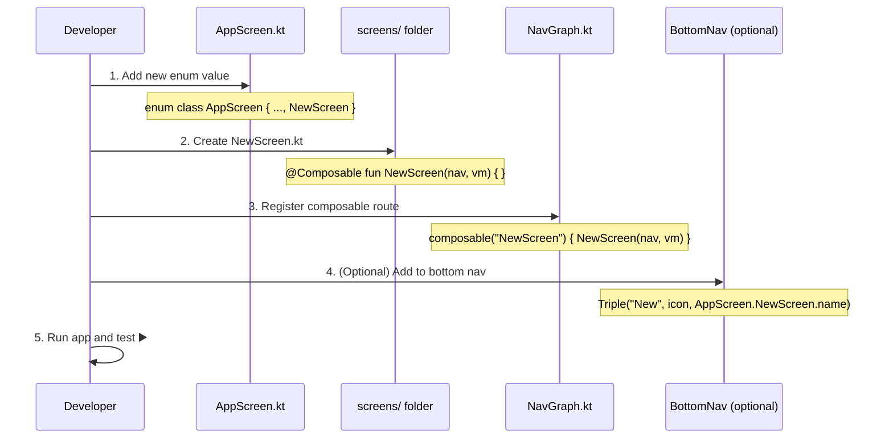

### How Files Communicate

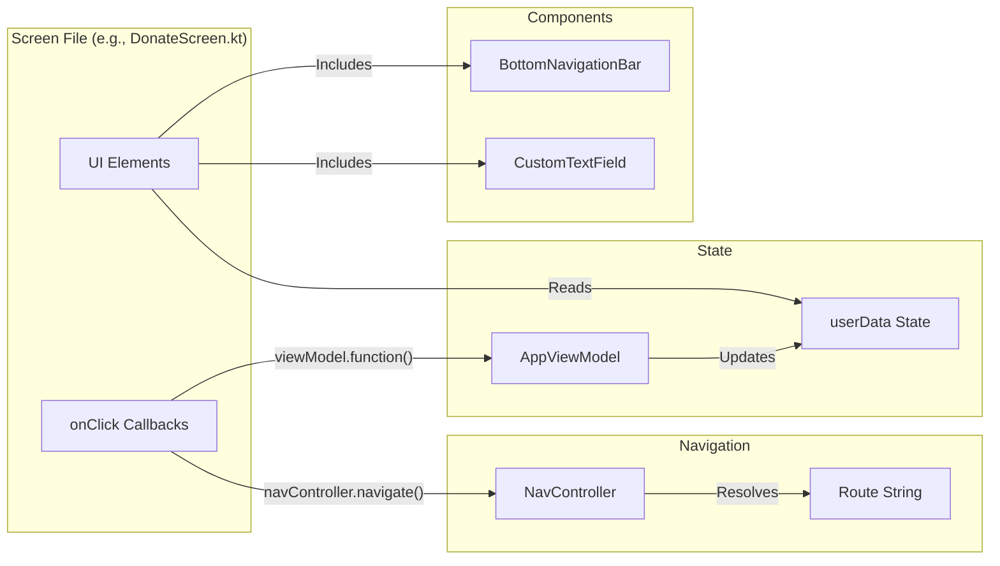

---

## 📦 Resource Management

### How Resources Connect to Code

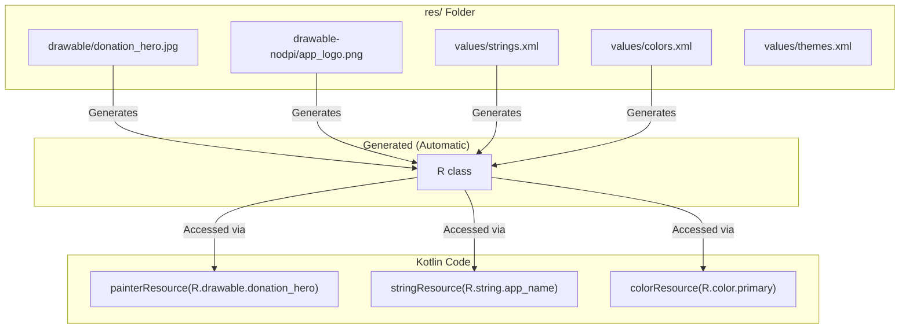

### Resource Types Explained

| Resource | Location | Access in Code | Example |
|----------|----------|---------------|---------|
| Images | `res/drawable/` | `R.drawable.filename` | `painterResource(R.drawable.donation_hero)` |
| HD Photos | `res/drawable-nodpi/` | `R.drawable.filename` | `painterResource(R.drawable.app_logo)` |
| App Icon | `res/mipmap/` | Set in AndroidManifest | Launcher icon |
| Strings | `res/values/strings.xml` | `R.string.name` | `stringResource(R.string.app_name)` |
| Colors | `res/values/colors.xml` | `R.color.name` | Used in themes |
| Themes | `res/values/themes.xml` | Applied in Manifest | App-wide styling |

### Rules for Resource Files

- ✅ Filenames must be **lowercase**
- ✅ Use **underscores** instead of spaces: `donation_hero.jpg`
- ❌ No special characters, hyphens, or capital letters
- ❌ No spaces in filenames
- 💡 After adding a resource, **rebuild** if `R.drawable.name` shows red

---

## 🏛️ Android Project Structure — How Android Studio Organizes Internally

### The Full Picture

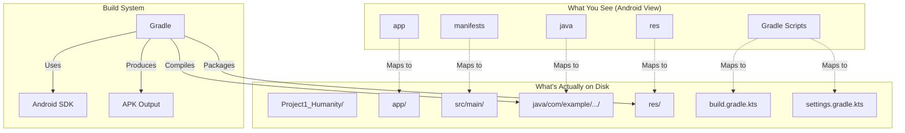

### Build Process (What Happens When You Press ▶️)

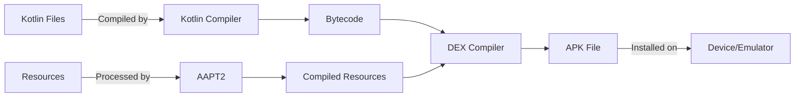

---

## 📚 Key Concepts for Beginners

### 🏠 MainActivity.kt — The Entry Point

Every Android app starts with an **Activity**. In this project, `MainActivity.kt` is the single activity that hosts the entire Compose UI. It sets up the theme and navigation controller.

```kotlin
class MainActivity : ComponentActivity() {
    override fun onCreate(savedInstanceState: Bundle?) {
        super.onCreate(savedInstanceState)
        setContent {
            AppTheme {
                val navController = rememberNavController()
                AppNavGraph(navController = navController)
            }
        }
    }
}
```

> 💡 With Jetpack Compose, you typically have **one Activity** and many **Composable screens**.

---

### 🧭 Navigation — Moving Between Screens

Navigation is defined in `navigation/NavGraph.kt`. Each screen is registered as a **composable route**:

```kotlin
composable(AppScreen.Login.name) {
    LoginScreen(navController, viewModel)
}
```

To navigate from one screen to another:

```kotlin
navController.navigate(AppScreen.Donate.name)
```

Screen names are defined in `navigation/AppScreen.kt` as an enum.

---

### 🎨 Composable Screens — The UI

Each `.kt` file in the `screens/` folder is a **Composable function** that defines a full screen's UI. This project does **not** use XML layouts — everything is written in Kotlin using Jetpack Compose.

Example pattern:

```kotlin
@Composable
fun DonateScreen(navController: NavHostController, viewModel: AppViewModel) {
    // UI code using Column, Row, Text, Button, etc.
}
```

---

### 🖼️ Drawable Resources — Images & Icons

Images and icons live in the `res/drawable/` and `res/drawable-nodpi/` folders:

| Folder | Purpose |
|--------|---------|
| `drawable/` | Vector icons, XML drawables, small images |
| `drawable-nodpi/` | Full-resolution photos (no density scaling) |
| `mipmap/` | App launcher icon only |

To use an image in Compose:

```kotlin
Image(
    painter = painterResource(id = R.drawable.donation_hero),
    contentDescription = "Donation"
)
```

---

### 📝 Values Resources — Strings, Colors, Themes

| File | Purpose |
|------|---------|
| `res/values/strings.xml` | App name and text constants |
| `res/values/colors.xml` | Color definitions |
| `res/values/themes.xml` | App-wide theme configuration |

---

## ➕ Where to Add New Files

| What you're adding | Where to put it |
|-------------------|-----------------|
| New screen | `screens/` → create a subfolder or add to existing one |
| Reusable UI component | `components/` |
| New data class/model | `data/` |
| New navigation route | Add to `AppScreen.kt` enum + register in `NavGraph.kt` |
| New image/icon | `res/drawable/` or `res/drawable-nodpi/` |
| New ViewModel | `viewmodel/` |
| Theme changes | `ui/theme/` |

> 💡 **Tip:** After adding a new screen, always register it in `NavGraph.kt` so the app can navigate to it.

---

## 📱 App Flow

```
SignUp → Login → Welcome → Main (Home)
                                │
                    ┌───────────┼───────────┐
                    │           │           │
                 Donate       Jobs      Volunteer
                    │
            DonationForm
                    │
               Summary
                    │
             BankLogin
                    │
              Approval
                    │
              Complete
                    │
             ThankYou

         Profile → EditProfile
```

---

## 🛠️ Troubleshooting

| Problem | Solution |
|---------|----------|
| Gradle sync fails | Check internet. Try **File → Invalidate Caches → Restart**. |
| "SDK not found" | **File → Project Structure → SDK Location** → set correct path. |
| Emulator won't start | Enable VT-x / AMD-V in BIOS settings. |
| Unresolved references | Run **File → Sync Project with Gradle Files**. |
| `R.drawable` not found | Ensure image filenames are lowercase with no special characters. Rebuild project. |
| App crashes on launch | Open **Logcat** (bottom panel) and look for the red error stack trace. |
| Compose preview not showing | Click **"Build & Refresh"** in the preview panel. |
| Slow build times | Close unused apps. Increase Gradle heap: `org.gradle.jvmargs=-Xmx4096m` in `gradle.properties`. |
| ViewModel data lost | Ensure you're using shared ViewModel instance, not creating new ones per screen. |
| Navigation crash | Check that all routes in `AppScreen` are registered in `NavGraph.kt`. |
| "Unresolved reference: R" | Rebuild project: **Build → Rebuild Project**. |

---

## 🧰 Tech Stack

| Technology | Purpose |
|-----------|---------|
| Kotlin | Programming language |
| Jetpack Compose | Declarative UI framework |
| Material 3 | Design system & components |
| Navigation Compose | Screen-to-screen navigation |
| ViewModel | State management across screens |
| Google Fonts | Custom typography |
| Gradle Version Catalog | Dependency management |

---

## 💡 Tips for New Developers

1. **Always use Android view** — it saves time navigating files.
2. **Use Logcat** to debug crashes — filter by your app's package name.
3. **Compose Preview** lets you see UI without running the app — add `@Preview` annotation.
4. **Hot Reload** — use "Apply Changes" (⚡ icon) for faster iteration.
5. **Don't edit Gradle files** unless you know what you're doing — a bad edit can break the build.
6. **Name files clearly** — use `ScreenName + Screen.kt` pattern (e.g., `DonateScreen.kt`).
7. **Read ViewModel first** — understanding `AppViewModel.kt` helps you understand the whole app.
8. **Follow the navigation** — start at `NavGraph.kt` to see how screens connect.
9. **One screen = one file** — keep each screen in its own `.kt` file for clarity.
10. **Commit often** — save your progress with Git after each working feature.

---

## 📄 License

This project is developed for educational purposes as part of the **TTTM2213** course.

---

<p align="center">
  Made with using Jetpack Compose & Kotlin
</p>
